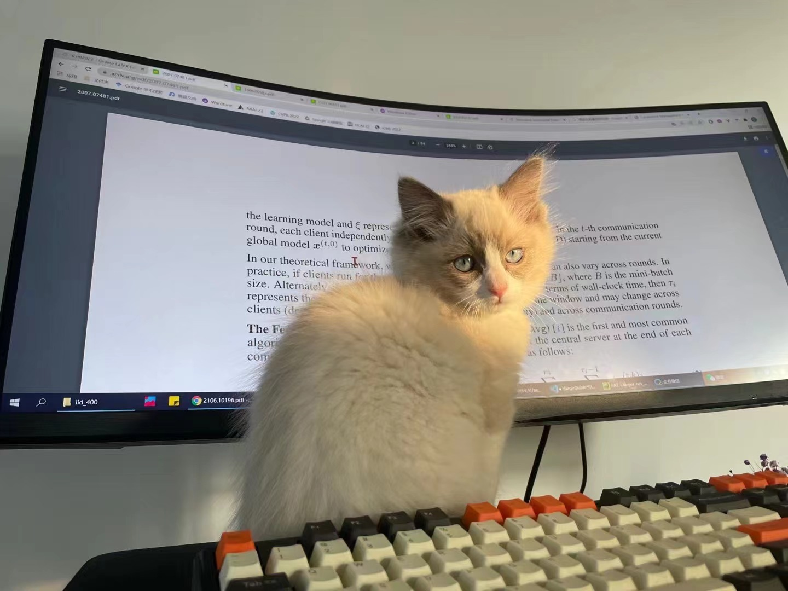
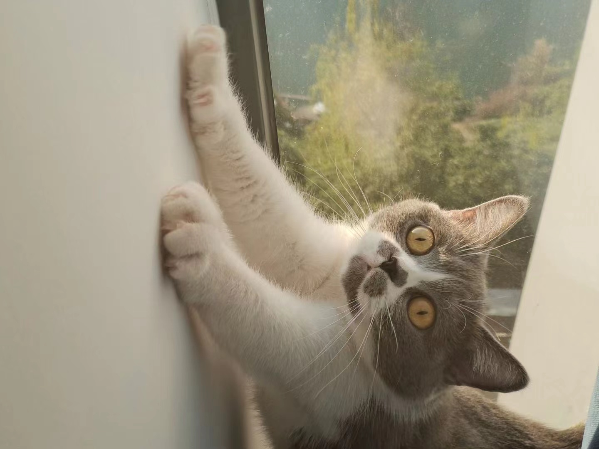

# 📖 Educations
- &#x1F393;  *2024.08 - Present*, PhD in Computer Vision, Mohamed Bin Zayed University of Artificial Intelligence, Abu Dhabi, UAE.
- &#x1F393;  *2022.08 - 2024*, Masters in Machine Learning, Mohamed Bin Zayed University of Artificial Intelligence, Abu Dhabi, UAE.
- &#x1F393;  *2019.08 - 2022.06*, Bachelors in Computer Science, Aligarh Muslim University, Aligarh, India.

# 💬 Services
- Journal Reviewer: 
    - IEEE Transactions on Circuits and Systems for Video Technology
    - IEEE Access
- Conference Reviewer: Sustainability and Resilience Conference (SRC) 2021, 2022, 2023.

# 💻 Internships
- *2023.06 - 2023.09*, [Fujairah Research Center](https://www.frc.ae/), Visiting Researcher, UAE.
- *2021.03 - 2022.07*, [Aligarh Muslim University](https://www.amu.ac.in/department/computer-science), Research Assistant, India.
- *2021.09 - 2021.12*, [National University of Malaysia, UKM](https://www.ukm.my/portalukm/), Research Intern, Malaysia.
- *2021.06 - 2021.08*, [Computer Science Society, AMU](https://www.cssamu.in/), Research Intern, India.
- *2021.05 - 2021.08*, [Indian Institute of Information Technology, Allahabad](https://www.iiita.ac.in/), Research Intern, India.

# 🎙 Miscellaneous

### Travel
I enjoy traveling with my family and friends. I am always excited about visiting new places and learning about different cultures.

### Sports
I love playing sports and always make time for football, badminton, and table tennis. I have played taekwondo professionally before and represented my university in badminton and table tennis competitions.

<!-- ### My cat
My girlfriend and I have three cats together, they are very adorable and have brought a lot of fun to our lives! -->

<!--   
 
  -->

<!-- 
Football Team

MBZUAI Sports Week

Georgia Trip
 -->

    

        
Football Team

        
    

    
    

        
MBZUAI Sports Week

        
    

    
    

        
Georgia Trip

        
    

